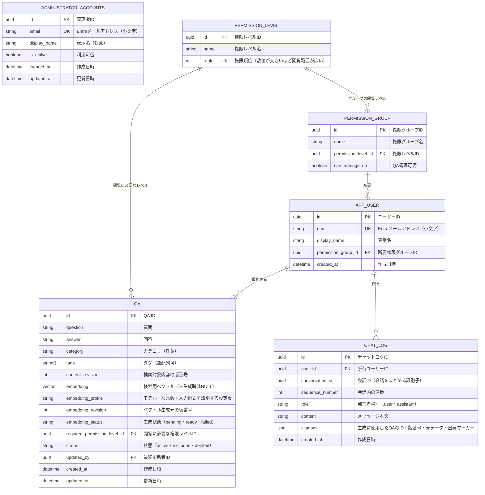
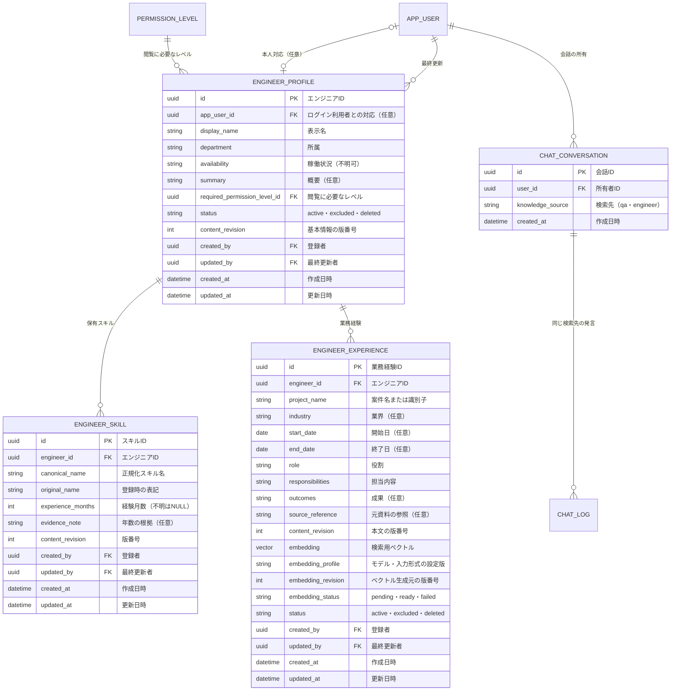

# ER図

現行実装でDB管理する対象は、QA・ユーザー・管理者アカウント・権限グループ・権限レベル・チャットログの6つ。QA本文と検索用Embeddingは同じQAテーブルで管理する。エンジニア情報の追加設計は後段に示す。

この案では、ユーザーは1つの権限グループに所属し、グループに設定された権限レベルを利用する。QAには閲覧に必要な権限レベルを設定する。グループの所属数とレベルの比較方式は設計上の仮定とする。

## 設計メモ

### 権限の設定

- QAごとに閲覧に必要な権限レベルを設定できる。
- ユーザーの権限レベルは所属グループから決まる。ユーザーのレベルがQAの要求レベル以上なら閲覧できる方式を想定する。
- レベルの例は、最低権限（0）・エンジニア向け（1）・バックオフィス向け（2）。業務QAは1以上とし、最低権限では業務データへアクセスできない。これはユーザーストーリーの「役割が未設定」の状態に対応する。
- QAの要求レベルの初期値はバックオフィス向けとする。エンジニアにも公開する場合はエンジニア向けへ変更する。
- QAの登録・編集は閲覧レベルとは別にグループの操作権限で判定する。利用者の権限管理は、有効な`administrator_accounts`に登録された管理者だけに許可する。
- 一覧・検索・詳細・AIに渡す検索結果・出典表示のすべてに最新の権限を適用する。

### ログイン時のユーザー自動登録

1. Microsoft Entra IDによる認証と、会社がアプリの利用を許可していることを確認する。
2. Entra IDのメールアドレスを小文字へ正規化してユーザーを検索する。メールアドレスには一意制約を設ける。
3. ユーザーが存在しなければ、ユーザーテーブルに行を自動追加し、エンジニアの初期グループへ所属させる。初回からエンジニア向けQAの閲覧とチャットを利用できる。初期グループはQA管理・利用者管理の権限を持たない。
4. 既存ユーザーの場合は現在のグループを維持し、ログインのたびに初期グループへ戻さない。同時ログインでも重複登録しないようにする。
5. 登録後、`administrator_accounts`に手動登録された管理者が必要に応じて所属グループを変更する。

初期グループとエンジニア権限レベルはあらかじめ用意する。`administrator_accounts`はアプリケーションから自動追加・更新せず、運用担当者がメールアドレスを小文字で手動登録する。有効な管理者はバックオフィス相当の閲覧・QA管理権限と利用者管理権限を持ち、`is_active`の変更は次のリクエストから反映する。

技術構成とAI処理の実装方式は[README](../README.md#技術構成の前提)を参照。

### QAとチャットログの保存

- PDF入力 → AIがQA形式に抽出 → 画面上に追加項目として表示 → 利用者が編集・選択 → 登録、の流れとする。登録前の項目は画面の一時データとして扱い、DBには保存しない。
- 登録操作で確定したQAだけをQAテーブルに`active`で保存し、Embeddingを生成する。手動入力とPDFからの抽出で保存形式を分けない。チャットの検索対象は`active`かつ現在の内容・設定に対応するEmbeddingが生成済みのQAとする。生成中・失敗時も本文は保持し、管理画面で状態の確認と再試行ができる。
- DBはPDFを管理しない。PDF本体・ファイル名・ページ情報・抽出元との関連は保存しない。PDFの解析状態やエラーは入力画面で扱う。
- QAには更新者と更新日時を記録する。更新・除外後の検索は現在の内容と状態を反映する。
- `question`・`answer`・`category`・`tags`は1件のQAが持つカラムとし、カテゴリ・タグのマスタや中間テーブルは初期構成に設けない。`category`は任意、`tags`はPostgreSQLの`text[]`（既定値は空配列）とする。
- 共有された会話の`source`は一般的なカラム例であり、本アプリには追加しない。出典は登録済みQAそのものであり、PDF由来の情報を保存しない既存要件を維持する。
- `embedding`はpgvectorの`vector(768)`型とする。初期実装は`gemini-embedding-001`の768次元出力を採用する。`embedding_profile`はモデルID・次元数・文書／質問の入力形式・正規化方式をまとめた不変の設定識別子とし、初期値は`gemini-embedding-001:768:retrieval-v1`とする。設定の実体はサーバーの構成で管理する。
- `content_revision`は1から始め、質問・回答・カテゴリ・タグの変更時に増やす。同じトランザクションでEmbeddingを無効化する。`ready`ではEmbedding・設定識別子・生成元版番号が必須で、`embedding_revision = content_revision`を満たす。生成状態・QA状態はそれぞれ列挙した値に制約する。
- 公開範囲・除外・削除はEmbeddingと独立して即時に反映する。生成結果は対象の版番号が変わっていない場合だけ保存する。詳しい検索条件・再試行手順は[RAG設計](rag-design.md)を参照。
- チャットログは1メッセージ1行とし、`conversation_id`で会話をまとめる。会話内の`sequence_number`は一意にする。
- 回答の出典はassistant行の`citations`に保持する。QAのID・`content_revision`、回答時の質問・回答、回答内の出典マーカーを格納し、別テーブルは設けない。JSON内のQA参照の整合性はアプリ側で管理する。
- 履歴の権限・版確認のため、`citations`には生成へ渡した全QAをサーバー側で記録する。回答内で引用されなかったQAの出典マーカーは空配列とし、出典画面にはマーカーのあるQAだけを表示する。
- 過去のログや出典を表示・会話文脈に再利用するときも現在のQAの権限と状態を確認する。権限変更・削除・更新により利用できなくなった情報を再開示しない扱いとする。

## 追加設計：エンジニア情報

エンジニアの検索対象データはログイン用`APP_USER`や業務`QA`と分ける。1人に複数のスキル・業務経験を持たせ、経歴の文章を案件単位でEmbedding化する。以下は論理モデルであり、マイグレーションは未実装。

チャットの検索先は追加する`CHAT_CONVERSATION`に`qa`または`engineer`として保存し、会話作成後は変更しない。`CHAT_LOG.conversation_id`をこのテーブルの外部キーにし、既存の会話は`qa`で移行する。検索先を切り替える場合は別の会話を作る。

`PERMISSION_GROUP`にはエンジニア情報の管理操作権限`can_manage_engineer_profiles`を追加する。初期案ではバックオフィス権限だけが閲覧できる設定とする。経歴に個別の非公開条件が必要になれば`ENGINEER_EXPERIENCE`にも要求レベルを追加する。検索先はクライアント指定だけで決めず、`CHAT_CONVERSATION.knowledge_source`と現在の権限をサーバーで確認する。出典を含む履歴の保持・再表示は[RAG設計](rag-design.md#エンジニア情報を使う検索と回答)を参照。

エンジニア情報の会話では、`CHAT_LOG.citations`に表示用のエンジニアIDと出典マーカー、内部検証用のプロフィール・スキル・業務経験のIDと版番号を保存する。画面にはエンジニア単位で出典をまとめ、詳細ページ`/engineers/{engineer_id}`へリンクする。詳細ページの表示内容は保存済み出典JSONをそのまま出さず、現在のDB状態と閲覧権限から取得する。

[エンジニア情報のDB・RAG設計](engineer-profile-design.md)・[ユーザーストーリー](user-stories.md)・[ユースケース図](use-cases.md)・[README](../README.md)
