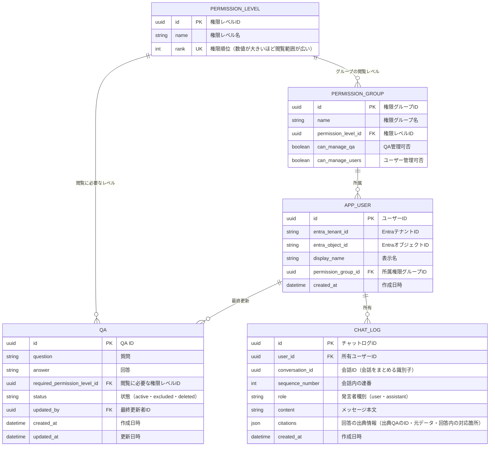

# ER図

DBで管理する対象を、QA・ユーザー・権限グループ・権限レベル・チャットログの5つに絞った構成案。

この案では、ユーザーは1つの権限グループに所属し、グループに設定された権限レベルを利用する。QAには閲覧に必要な権限レベルを設定する。グループの所属数とレベルの比較方式は設計上の仮定とする。

## 設計メモ

### 権限の設定

- QAごとに閲覧に必要な権限レベルを設定できる。
- ユーザーの権限レベルは所属グループから決まる。ユーザーのレベルがQAの要求レベル以上なら閲覧できる方式を想定する。
- レベルの例は、最低権限（0）・エンジニア向け（1）・バックオフィス向け（2）。業務QAは1以上とし、最低権限では業務データへアクセスできない。これはユーザーストーリーの「役割が未設定」の状態に対応する。
- QAの要求レベルの初期値はバックオフィス向けとする。エンジニアにも公開する場合はエンジニア向けへ変更する。
- QAの登録・編集と利用者の権限管理は、閲覧レベルとは別にグループの操作権限で判定する。管理者とバックオフィスを兼任するグループは両方の操作権限を持つ。
- 一覧・検索・詳細・AIに渡す検索結果・出典表示のすべてに最新の権限を適用する。

### ログイン時のユーザー自動登録

1. Microsoft Entra IDによる認証と、会社がアプリの利用を許可していることを確認する。
2. Entra IDのテナントIDとオブジェクトIDの組でユーザーを検索する。この組には一意制約を設ける。
3. ユーザーが存在しなければ、ユーザーテーブルに行を自動追加し、最低権限の初期グループへ所属させる。初期グループはQA管理・利用者管理の権限も持たない。
4. 既存ユーザーの場合は現在のグループを維持し、ログインのたびに最低権限へ戻さない。同時ログインでも重複登録しないようにする。
5. 登録後、管理者が必要に応じて所属グループを変更する。

初期グループと最低権限レベルはあらかじめ用意する。初回の管理者を設定する方法は設計時に決める。

技術構成とAI処理の実装方式は[README](../README.md#技術構成の前提)を参照。

### QAとチャットログの保存

- PDF入力 → AIがQA形式に抽出 → 画面上に追加項目として表示 → 利用者が編集・選択 → 登録、の流れとする。登録前の項目は画面の一時データとして扱い、DBには保存しない。
- 登録操作で確定したQAだけをQAテーブルにactiveで保存する。手動入力とPDFからの抽出で保存形式を分けず、検索対象はactiveのみとする。
- DBはPDFを管理しない。PDF本体・ファイル名・ページ情報・抽出元との関連は保存しない。PDFの解析状態やエラーは入力画面で扱う。
- QAには更新者と更新日時を記録する。更新・除外後の検索は現在の内容と状態を反映する。
- チャットログは1メッセージ1行とし、`conversation_id`で会話をまとめる。会話内の`sequence_number`は一意にする。
- 回答の出典はassistant行の`citations`に保持する。QAのID、回答時の質問・回答、回答内の出典マーカーを格納し、別テーブルは設けない。JSON内のQA参照の整合性はアプリ側で管理する。
- 過去のログや出典を表示・会話文脈に再利用するときも現在のQAの権限と状態を確認する。権限変更・削除・更新により利用できなくなった情報を再開示しない扱いとする。

[ユーザーストーリー](user-stories.md)・[ユースケース図](use-cases.md)・[README](../README.md)
