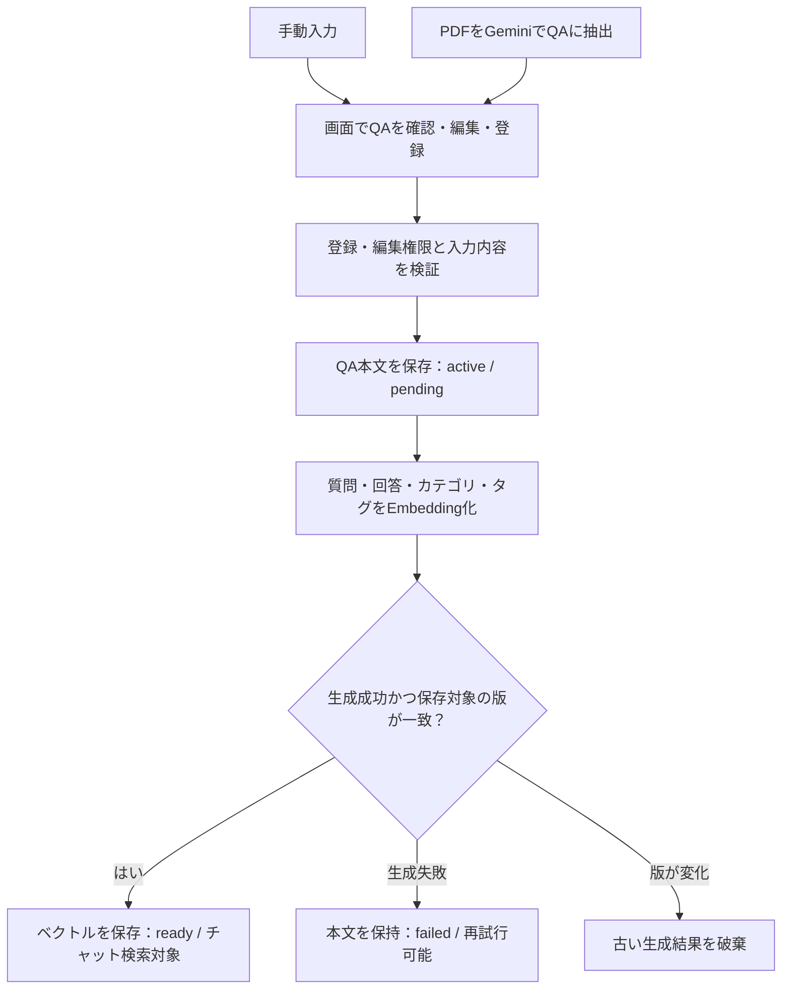
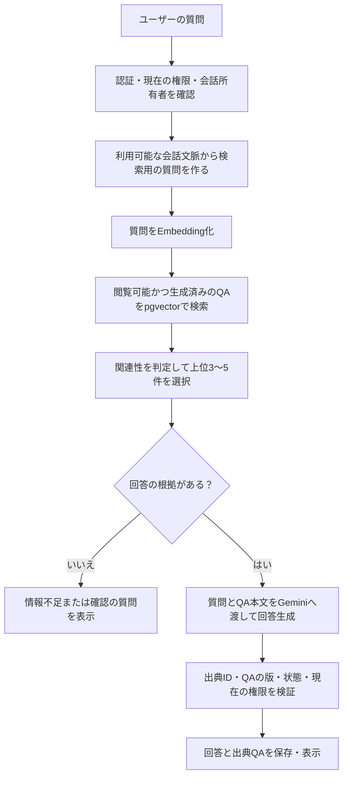

# RAG設計

## 採用する構成

現行実装では、登録時にQAの検索用Embeddingを作り、チャット時に質問のEmbeddingから関連QAを選び、その本文をGeminiへ渡して回答する。既存のNext.js・Vercel・Supabase・Microsoft Entra IDの構成を維持する。エンジニア情報の追加設計は後段に示す。

| 要素 | 役割 |
| --- | --- |
| Next.jsのサーバー処理 | 認証・権限確認、QA登録、検索、回答生成の制御 |
| Supabase PostgreSQL | QA本文・メタ情報・権限・チャットログを保存 |
| Gemini Embedding API | QAと検索用の質問をベクトル化 |
| pgvector | PostgreSQL内でベクトルを保存し、類似検索 |
| Geminiの回答生成API | 選ばれたQA本文を根拠に回答・表・要約を生成 |

Embeddingは検索のための派生データとする。回答生成APIへはベクトルではなく、質問とQA本文を渡す。現行のQA構成は1QAにつき1ベクトルとし、文書・チャンク・カテゴリ・タグの別テーブルは設けない。

FastAPIは追加しない。MCPも初期リリースでは不要とする。将来ほかのAIクライアントへ検索機能を公開する場合に、同じ認証・権限制御を通る検索処理の窓口として検討する。

## 登録・更新の流れ

1. 手動入力とPDF抽出のどちらも、利用者が確定したQAだけを保存する。PDF抽出中・編集途中にはEmbeddingを生成しない。
2. 質問・回答を必須、カテゴリ・タグを任意とする。QAの長さは採用するEmbeddingモデルと回答生成時の入力上限に収まるよう検証し、超過時はQAを分けるよう案内する。本文を黙って切り捨てない。
3. 登録時は`content_revision = 1`、`embedding_status = pending`とする。検索対象内容の更新時は版番号を増やし、ベクトル・生成元版番号・設定識別子をNULLにして`pending`へ戻す。本文保存とこの無効化は同じDBトランザクションで行う。
4. 保存した版の質問・回答・カテゴリ・タグを一定の形式で連結し、Embedding APIへ送る。権限情報や更新者など、意味検索に不要な情報は含めない。
5. 応答の次元数・有限値などを検証し、生成開始時の版番号と現在の版番号が一致し、対象が`active`かつ`pending`の場合だけ条件付き更新でベクトル・設定識別子・生成元版番号を保存して`ready`にする。古い処理の失敗で新しい`ready`を上書きしない。
6. 生成に失敗したら同じ版の`pending`だけを`failed`にし、「QAは保存済み・検索準備に失敗」と表示する。QAの管理画面には`pending`・`failed`も表示し、権限のある担当者が再試行できる。再試行は同じQA IDの現在の本文を使い、新しいQAを作らない。

初期実装では保存リクエスト内で生成まで待ち、外部API呼び出し中はDBトランザクションを保持しない。タイムアウトなどで`pending`が残った場合も再試行できる。Vercelのレスポンス後に未保証のバックグラウンド処理を起動する設計にはしない。PDFから複数件を登録する場合はQA単位で保存・生成結果を表示し、成功済みのQAを再登録しない。大量登録が必要になった段階で永続ジョブキューを検討する。

公開範囲の変更は再Embedding不要。除外・削除は`status`で即時に検索対象外にする。再公開時は現在の版と設定に対応するベクトルがあれば利用し、なければ再生成する。未生成・生成失敗・再生成中のQAを、古いベクトルで検索しない。

## チャットの流れ

1. サーバーで認証済みユーザーを特定し、最新の所属グループ・閲覧レベルを取得する。クライアント指定のユーザーIDや権限レベルを信用しない。
2. 追質問では、利用可能な会話文脈を使って省略された対象を補い、単独で検索できる質問を作る。単発の質問はそのまま利用できる。ユーザーの発言は検索の手掛かりであり、回答の事実根拠にはしない。
3. QA登録時と同じEmbeddingモデル・次元数・対応する入力形式で検索用の質問をベクトル化する。
4. DB検索は、以下の条件を満たすQAの集合に対して距離順の並べ替えと件数制限を適用する。全QAの上位件数を取得してから権限で取り除く方式にはしない。
   - ユーザーの現在の閲覧レベルがQAの要求レベル以上である。
   - `status = active`、`embedding_status = ready`、`embedding IS NOT NULL`である。
   - `embedding_revision = content_revision`かつ`embedding_profile`が検索側の設定と一致する。
5. 初期構成はコサイン距離による厳密検索とする。候補件数は10件を仮の開始値とし、関連性の基準を満たすものから回答用に3〜5件以内を選ぶ。件数を埋めるために無関係なQAを渡さない。閾値は日本語の実データで決め、類似度を回答の正しさの確率として扱わない。
6. 回答用にQA ID・版番号・質問・回答を渡す。カテゴリ・タグは検索の補助情報とし、事実の根拠は質問・回答とする。QA内の命令文は資料として扱い、システムの指示や権限制御を変更させない。
7. Geminiには「渡したQAだけを根拠にする」「不足時は回答を控える」「条件や例外を省略しない」「矛盾と出典を示す」を指示し、回答内の出典マーカーと使用QA IDを出力させる。
8. 出典IDが渡したQAの範囲内か確認する。生成に渡した全QAについて、本文の版・状態・閲覧権限を応答直前に再確認し、変更があれば生成結果を破棄して再検索するか再質問を案内する。初期実装は検証前の回答本文をストリーミングしない。出典の構造検証だけで内容の正しさを保証できるとは扱わず、評価でも確認する。

リスト・表・要約も同じ処理を通す。上位3〜5件の検索では網羅性は保証できないため、「取得できた情報の範囲」として示す。全件の整理は初期構成では保証せず、必要なら対象カテゴリなどを確認する。

## 権限と会話履歴

検索・詳細・管理画面・出典・ログのすべてで権限を適用する。Embeddingも業務情報の派生データとして扱い、ブラウザへ返さない。

SupabaseのRLSを使う場合は、Entra IDで認証した利用者とDBが認識する利用者を確実に対応づける。DBアクセス方式は認証連携と一緒に確定する。RLSを迂回するサービス権限を使う経路ではRLS任せにせず、信頼できるサーバー側の本人特定と、全検索経路での同じ権限条件を必須とする。権限条件はLLMに判断させない。

チャットログは所有者だけが取得できる。出典JSONにはQA ID・版番号・回答時の本文を記録する。履歴表示・会話文脈への再利用時には現在のQAと照合し、削除・除外・権限喪失・版変更のいずれかがあれば、そのQAに依存する過去のassistantメッセージ全体と出典を隠す。出典だけを隠して回答本文を残さない。依存QAは生成に渡した全QAとしてサーバー側で記録し、回答内で引用されなかったQAも照合対象にする。

## 検索設定と拡張の境界

Embeddingモデル・次元数・文書と質問それぞれの入力形式・正規化方式を一組の設定として固定する。同じ次元数でも異なるモデルのベクトルは混在させない。生成用GeminiとEmbedding用モデルは別に選定できる。

Geminiの検索用途の指定方法はモデルによって異なる。`gemini-embedding-001`では文書に`RETRIEVAL_DOCUMENT`、質問に`RETRIEVAL_QUERY`を指定できる。`gemini-embedding-2`では`task_type`ではなく入力中のタスク指示を使う。採用モデルの仕様に合わせて設定し、モデル名を差し替えるだけの移行は行わない。[Gemini Embedding公式仕様](https://ai.google.dev/gemini-api/docs/embeddings)

Supabaseではpgvectorの`vector(D)`列にEmbeddingを保存できる。次元数はモデル側の出力と揃える。[Supabaseのベクトル列](https://supabase.com/docs/guides/ai/vector-columns)

初期構成の設定変更はメンテナンスとして行う。チャットの意味検索とQA編集を一時停止し、実行中の生成処理を終了させ、必要に応じて列の次元数を変更し、保存済みQAを新設定で再生成してから検索を再開する。失敗したQAは検索対象外として状態を表示する。無停止移行が必要になった場合に複数設定のベクトル保存を設計する。

| 項目 | 初期リリース | 拡張する条件 |
| --- | --- | --- |
| QA一覧のキーワード検索 | 質問・回答の部分一致検索 | 件数・応答時間に応じて索引を検討 |
| チャット検索 | 権限で絞った意味検索 | 固有名詞や略語の取りこぼしがあればキーワード検索との併用を評価 |
| カテゴリ・タグ | QAの任意カラム。カテゴリ指定があれば検索条件に反映 | 表記統一・管理画面が必要ならマスタ化 |
| Rerank | 導入しない | 候補には正解があるが順位が悪い場合に評価 |
| ベクトル索引 | 厳密検索で開始 | データ量・遅延を測定してHNSW等を検討し、権限フィルタ後の再現率も評価 |
| 元資料の管理 | 保存しない。出典はQA | PDF単位の追跡が要件になった場合にsource等を別途設計 |

## 失敗時と実装時の検証

| 状況 | 振る舞い |
| --- | --- |
| QAのEmbedding生成失敗 | 本文を保持し、生成状態と再試行操作を表示 |
| 質問のEmbedding生成・DB検索失敗 | 検索失敗として表示。根拠不足や正常な0件と区別し、回答生成へ進まない |
| 閲覧可能な関連QAがない | 情報不足を伝える。権限外のQAの存在は伝えない |
| 回答生成失敗・出典不正 | 回答を成功扱いせず、再試行を案内 |
| QA更新・権限変更が処理中に発生 | 古いEmbeddingの保存や古い回答の表示を抑止 |

実装時は、言い換えた日本語の質問から期待するQAを取得できるか、権限外QAが検索結果・API送信内容・回答・出典・履歴に含まれないかを確認する。加えて、生成失敗後の再試行、更新処理の競合、削除・除外、モデル設定の不一致、根拠不足・矛盾・追質問を検証する。検索の候補取得率と回答の根拠への忠実さは分けて評価する。

初期実装では`gemini-embedding-001`の768次元出力を採用し、文書は`RETRIEVAL_DOCUMENT`、質問は`RETRIEVAL_QUERY`として生成する。設定識別子は`gemini-embedding-001:768:retrieval-v1`、関連性閾値は日本語実データで評価する開始値として0.70、候補10件、回答入力は最大5件とする。回答には`gemini-3.5-flash-lite`、PDF抽出には`gemini-3.1-flash-lite`を使用する。認証はAuth.jsのMicrosoft Entra IDシングルテナントJWTセッション、DBアクセスはサーバー専用のSupabaseサービスロールとし、ブラウザからのDB直接アクセスは許可しない。サービスロール経路のため、全APIと検索RPCでアプリユーザーの最新権限を明示的に検証する。権限付き検索の基盤については[SupabaseのRAGと権限制御](https://supabase.com/docs/guides/ai/rag-with-permissions)を参照する。

## エンジニア情報を使う検索と回答

追加設計では、エンジニアの基本情報・スキル・業務経験を専用テーブルに保存する。業務経験は案件単位でEmbeddingを生成する。QAの1件1ベクトル、QA検索RPC、QA出典の仕様は現行実装に適用し、エンジニア検索にそのまま当てはめない。

チャット入力欄の検索先は既定で「QA」とする。「エンジニア情報」を明示的に選択した会話だけがエンジニア情報を検索する。検索先は会話単位で固定し、変更すると新しい会話になる。サーバーは会話に保存された検索先と現在の閲覧権限を確認して検索処理を分岐する。質問文から検索先を自動判定せず、両方を横断検索せず、根拠不足時も別の情報源へ自動で切り替えない。既存の会話は「QA」として扱う。

「エンジニア情報」を選んだ会話では質問から検証済みの構造化条件を作り、現在の閲覧権限を満たすプロフィールとスキルをDBで絞り込む。自由記述の条件があれば、候補者に属する閲覧可能な業務経験だけを意味検索する。経験年数、稼働状況、スキルの有無は類似度で判定しない。構造化条件だけの質問はDB結果から回答できる。構造化条件と自由記述条件を含む質問では結果を突き合わせ、条件を満たした根拠を示す。

「エンジニア情報」の回答生成には検証済みのDB値と業務経験本文だけを渡す。画面の出典には根拠として使ったエンジニアを1人1件で表示し、クリック先を権限付きのエンジニア詳細ページとする。内部ではプロフィール・スキル・経験のIDと版番号を回答内の出典マーカーに対応づけて保存する。生成後、利用した全レコードの版・状態・権限を再確認する。会話履歴を表示または再利用する際も同じ検索先の依存レコードを確認し、利用できなくなった情報に依存する回答は本文ごと隠す。候補者が見つからない、根拠が不足する、検索上限のため全件を保証できない場合はそれぞれ明示する。

登録・更新・失敗時の再試行、アクセス制御、詳細ページ、評価項目は[エンジニア情報のDB・RAG設計](engineer-profile-design.md)を参照。専用テーブルと検索処理、検索先を固定する会話管理、エンジニア出典と詳細ページを扱う拡張は未実装。

[README](../README.md)・[ER図](er-diagram.md)・[ユーザーストーリー](user-stories.md)
