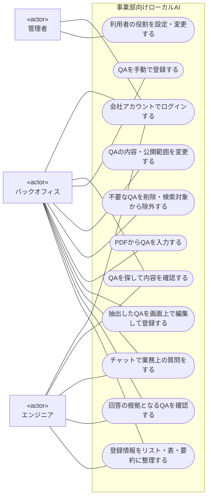

# ユースケース図

[ユーザーストーリー](user-stories.md)を基に、アクターがこのアプリで達成する目的を示す。Mermaidのflowchartを使い、システム境界・アクター・ユースケース・関連を表現する。

枠の外がアクター、枠の内側の丸いノードがユースケース。線は参加するアクターとの関連を表し、処理順序やデータの流れを意味しない。管理者とバックオフィスを兼任する人は、両方のアクターとして参加する。

## ユーザーストーリーとの対応

| ユースケース | 対応するストーリー |
| --- | --- |
| 会社アカウントでログインする | US-01 |
| 利用者の役割を設定・変更する | US-03 |
| QAを探して内容を確認する | US-02・05 |
| QAを手動で登録する | US-04 |
| QAの内容・公開範囲を変更する | US-05 |
| 不要なQAを削除・検索対象から除外する | US-05 |
| PDFからQAを入力する | US-06 |
| 抽出したQAを画面上で編集して登録する | US-07 |
| チャットで業務上の質問をする | US-08（US-10・11の振る舞いを含む） |
| 回答の根拠となるQAを確認する | US-09 |
| 登録情報をリスト・表・要約に整理する | US-12（US-09〜11の振る舞いを含む） |

## 事前条件・代替フロー・制約

これらは各ユースケースの成立条件や振る舞いとして記述する。Microsoft Entra IDは認証基盤として扱い、この図のアクターには含めない。技術構成は[README](../README.md#技術構成の前提)を参照。

- **認証・利用許可（US-01）**：ログイン以外の操作は、会社が利用を許可したログイン済みユーザーに限定する。ログイン成功時にユーザーがDBに存在しなければ、最低権限で自動登録する（[設計メモ](er-diagram.md#設計メモ)）。
- **閲覧権限（US-02・03）**：バックオフィスは全QA、エンジニアは公開が許可されたQAだけを利用する。業務上の役割が未設定なら業務データへアクセスさせない。管理者権限とQA閲覧権限は別に扱い、権限変更後は最新の権限を適用する。検索結果をAIへ渡す前にも制限し、回答や出典から非公開QAの存在を漏らさない。
- **PDF入力とQA登録（US-06・07）**：AIがPDFからQA形式に抽出した内容を、画面上に追加項目として表示する。利用者が編集・選択して登録したQAだけをDBに保存し、Embedding生成後にチャットの検索対象にする。登録前の項目は画面の一時データとして扱い、DBはPDFや抽出元の情報を保持しない。PDF解析の失敗やQAを抽出できない場合は、その状態を画面に表示する。
- **検索準備と意味検索（US-04・05・07・08）**：保存済みQAの質問・回答・カテゴリ・タグからEmbeddingを生成し、質問のEmbeddingと比較して関連QAを探す。本文保存と検索準備の状態を区別し、生成失敗時は保存済みQAから再試行する。本文更新時は古いEmbeddingを無効化する。閲覧権限・公開状態は検索の候補選定時から適用する。詳細は[RAG設計](rag-design.md)を参照。
- **回答の代替フロー（US-10）**：根拠が不足する場合は不足を伝え、部分的に回答できる場合はその範囲を示す。質問が曖昧な場合は確認の質問をする。
- **回答・整理結果の制約（US-08・09・11・12）**：登録済みQAだけを事実の根拠とし、出典を表示する。会話の文脈は利用するが、ユーザー発言や一般知識で事実を補わない。QAの意味・条件を保ち、矛盾があれば矛盾と出典を示す。網羅性を確認できない場合は断定しない。
- **AIが扱う情報の制限（US-13）**：PDF入力時は利用者が入力したPDFをQA抽出に使用する。QA登録・更新時は確定した質問・回答・カテゴリ・タグをEmbedding APIに渡す。検索時は質問または権限確認済みの文脈から作った検索文をEmbedding APIに渡す。チャット回答や情報整理では、質問・必要な会話文脈・閲覧可能な関連QAを回答生成APIに渡す。権限変更後の会話文脈にも現在の権限を適用し、AI処理に失敗した場合は画面に失敗を表示する。

[READMEへ戻る](../README.md)
